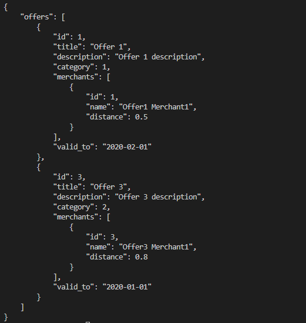

#  Setup Environment
1. Install necessary modules
   - npm install 

# Start the application
    npm run start

# CRITERIA
### 1. Code Flow
- All code will be put in the src folder
  - With constants of the project we can put in the constants folder
  - The controllers folder uses to handle the responses to the Frontend
  - The models folder will contain necessary entities of the projects.
  - The services folder will handle the complicated logic of each service.
  - The test folder has all unit tests of each service.
  - The utils folder will contain all functions that can be reused of the project.
### 1b. Code Result

### 2. Unit Test
a. Step to run:
  - npm run test
  
b. Unit Test Result
